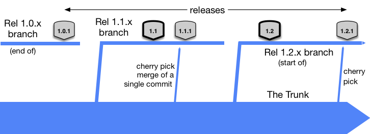

### Introduction

Software development has always been about one thing. Shipping code, new features, and delivering to their consumers as fast as possible. The story doesn't change, in fact, it only gets more severe as technology advances. The density of software in the market leaves no room for stale applications, buggy features, or unreliable services. LexisNexis is no exception. Our business outcomes are almost directly tied to IT performance. In addition, many of our applications are under heavy stress from activity all over the globe, all day, every day. We require high-security standards to protect our customers from potential cyber threats, and to protect our investments on-prem and in the cloud. And we're asked to continue improving the quality and reliability of our existing software while delivering new features to delight the user.

Throughout the organization, nearly every development strategy is in practice. For the most part, we show a commitment to Agile practices through task management tactics. These are merely tools that facilitate a more organized approach to work. Most teams still face a bottleneck that you may not have considered unless someone pointed it out to you. It takes too long for your code to go from your editor; to production. And it's probably not because you're slow at writing code. You could be, I don't know. I'm not particularly fast myself. But if you're anything like me, there are steps in the process of pushing code that simply takes too long. The good news is they can be either removed or modified to make you and your teams more efficient.

### About Me

I'm Dylan Justice, and I'm a Site Reliability Engineer. SRE for short. You may be most familiar with the SRE team during or after a production incident. We focus on our system's production infrastructure, solving operations problems using software engineering. This means building tools and automation to reduce our MTTR, or mean time to respond, to production issues. It also means ensuring our applications have appropriate levels of monitoring and alerting. We treat production issues as opportunities to learn and use those opportunities to reflect with application teams on how we can improve to reduce the likelihood of history repeating itself. Before becoming an SRE, I was a software engineer on product development teams for 9 years. I've worked with many languages in that time, both frontend and backend. But my background is primarily dotnet, with a more recent love developing in React. I have a couple of stories I'll integrate into the discussion that will help paint the picture of how trunk-based development transformed how I think about developing software forever.

### Git Flow / Traditional Software Development

A common approach to change management in software is for developers to branch off of either a mainline or development branch of the repository. They create feature branches to preserve the integrity of the main branch while they write changes intended to be merged back into the main branch downstream. When changes are complete, a pull request is opened and the code goes through a technical review by at least one peer, or in some cases a governing body of reviewers. Reviewers can request the author to make changes to the feature branch to meet standards and correct potential issues before they will approve the merge. A discussion is usually formed within the PR and the author will push new changes to the feature branch to satisfy the reviewers. When the branch meets the standards of the reviewers, and the required number of approvals has been reached, the PR is merged into the mainline branch and the work can be sent to the next stage of its lifecycle. This is usually a working or staging environment that allows functional testing, visual design review, and possibly performance testing to be performed on the new feature. Once the feature has passed the standards to be put into the production environment, a release is scheduled and eventually deployed to production.

This model is widely adopted and is considered a successful approach to working in version control with teams. It suits contributors of open-source software on Github. Contributors are usually not working on the project full time and may need a long-running branch to complete a task or issue over weeks or months. Git flow allows plenty of visibility and control over the main branch, preventing unwanted changes from being released to the production environment. In this model, releases are often thoroughly tested and vetted in lower environments before going to production. The cadence of releasing software tends to be on a monthly or quarterly basis. Although, it's not uncommon to have high-performing teams working in this model doing weekly releases.

### Trunk Based Development: Introduction

> Trunk based development is a "source-control branching model, where developers collaborate on code in a single branch called `trunk`, resist any pressure to create other long-lived development branches by employing documented techniques. They therefore avoid merge hell, do not break the build, and live happily ever after" [(1)][1].

DORA: 3 or less active branches, merge branches to trunk at least once a day, not have code freezes or integration phases.

Now that we've discussed Git-Flow, how is TBD different? Git flow is highly dependent on branches, which can cause problems. Teams working in branches can become disconnected. Lack of communication can cause unexpected merge conflicts, regressions due to a bad merge, and worst of all: duplicated code. Trunk-based teams are committing early and often to the main branch, which allows contributors to share work as they build.
In many cases, trunk is linked directly to the production application. This means the build cannot be broken, and the team's priority is to maintain releasability. This often requires a mindset change. It's difficult at first to grasp the concept of having work-in-progress committed to the `trunk` and ready to be released at any time. In most cases, using feature flags to corral changes to existing code is an excellent way to manage this paradigm. By consistently maintaining a releasable main branch, you eliminate the need for a "code freeze" to stabilize the environment in preparation for a release. In _Accelerate_, the 2017 state of devops report claimed "developing off trunk/master rather than on long-lived feature branches was correlated with higher delivery performance" [(2)](#References). Performance in this context is measured in terms of release frequency, or lead-time. Since the core concept of TBD is maintaining releasability, product teams can release to production on a more frequent basis. In advanced cases, multiple times per day. In other words, changing your branching model can completely the way you and your team work for the better.

### Example No. 1: The Vicious Cycle

Consider this scenario:
Jack is an engineer developing a large feature for the application. At the beginning of the two-week sprint, he branches off the main branch and begins work. After a week, he opens a PR with his changes. It's a large diff and will take his teammates a significant chunk of time to review it. The team requires two peer approvals before the feature branch can be merged into the development branch, and everyone is working on features. After sitting un-reviewed for about a day, his teammates set aside enough time to review the PR. One teammate approves, and another leaves requested changes and will approve after Jack has completed the tasks. Another day passes and Jack completes all of the requested changes; his teammate approves. The PR is merged into the main branch and deploys the application to a staging environment. The QA team and Design team are notified the feature is ready for testing. Jack takes a new story and begins work on a new branch. That day, the QA Team comes back to him with issues that came up during testing. In addition, the design team has tweaks to the interface that need to be made.
There are now two days left in the sprint, and Jack opens another branch to fix the bugs. He opens another PR and requests a review from his teammates, which is quickly reviewed and merged. Jack notifies the team that the feature is ready to be re-tested and starts work on the other user story. Miraculously, the story passes both QA and design and is sent to the product owner for final verification before the end of the sprint.

This story may sound familiar as Jack is far from exceptional.

What are some of the issues that affected Jack's performance during the sprint?

<!-- Note: Could be fun to do a 1-2-4-All for this. -->

1. He didn't ask for any input during the development phase and resulted in a long code review process.
2. He wasn't able to get feedback from QA or Design until after all of the work he thought the feature required was completed.
3. The code review process left him without work and in limbo.

This scenario highlights a few issues that can be alleviated through the implementation of TBD as well as general agile concepts.

Huge PR's are a well-known nightmare for software engineers. The memory of a friendly note from a colleague asking for a "quick PR" on a 150 file diff on Friday afternoon is enough to send shivers down my spine. It also forces the reviewers to choose between a quality review and meeting their deadlines. Delivering code in smaller, digestible chunks leads to faster feedback loops with peers, faster deployments and ultimately reduced lead time. At scale, trunk based development is aligned with the theory of having short-lived feature branches (think hours, not days) that are branched off of trunk, and merged back in assuming Continuous Integration passes. This requires a shift in the planning phase of the work, to ensure work is broken down into the smallest vertical slices possible, and engineers can deliver increments in less than a day.

The key is releasability. Jack would need to shift his development approach from "building a feature", to "releasing the first deliverable increment." If Jack had been able to release within hours of starting his task, he could have asked for initial feedback from not only his fellow engineers but from QA and Design before he gets too far down the road. With a short feedback loop, rework becomes smaller, or in some cases non-existent. It sort of dissolves into the development workflow.

### Provocative Concepts: Continuous Code Review

- Extension of Continuous integration
- Pair programming as code review
- Pre-commit code review
- Post commit code review
- Enterprise Code review
If code reviews are difficult, developers avoid checking in work frequently because of overhead. Pare down code review process to make it quick and easy.
Asynchronous code review
### Example No. 2: Release Branches

Let's consider a product development team that is not using TBD. The team uses four branches, `development`, `working`, `staging`, and `production`. They work off of the `development` branch, and the other three are configured to deploy automatically to the respective integrated environments when changes were merged. On commit, Jenkins triggers an automated build to deploy code to the respective environment. Engineers will create feature branches and merge via a PR to `development`, where a CI process runs unit and integration tests. Once that passes, the engineer can merge `development` into `working` to trigger the deployment to the integrated test environment. The team is working in two-week sprints and deploys to `staging` after every sprint. The stakeholders run smoke tests and sign off on the production release shortly after. If an issue occurs in an elevated environment, a PR is created against the branch and subsequently merged down to `development`.

This is a relatively strict workflow for the team. They have a structured process of promotion and the engineers don't have full control over the release process. Like Jack's team, this creates long lead times between development and production. So, how does trunk based development help this team? And what does the implementation look like from a CI and release process?
This team deviates from TBD in several ways:

1. There are too many branches to maintain. Engineers have to consciously maintain the state of their work in each environment.
2. Allowing changes to the release branches can cause merge conflicts and pain. It can also introduce regressions to other environments.
3. The `working`, `staging` and `production` branches are kept alive for a series of releases. In a branch-for-release strategy, "the principal mechanism to land code on that branch is the branch creation itself" [(3)][3].

Since the team has three integrated environments, we'll consider `working` to be our new trunk, since it continuously deploys to the `working` environment. `development`, `staging`, and `production` will be deleted. The team now works off of `main`, formerly `working`. The release process to `staging` and `production` is now broken, and the CI job has been abandoned. To re-institute the "Don't break the build", we'll add a pull-request trigger to the main branch. The CI build will run whenever a pull request is opened for `main`, and a branch policy will require the build to pass before merging. Now commits are flowing to the `main` branch, and we need to handle a release. Staging and Production will both release the same way, but instead of deploying code from a branch, they will deploy from a git tag. When the team is ready to release, they can tag the commit in `main` and trigger the deployment with the specified tag, say `1.21.0`. When the release is verified and ready to be deployed to production, the same tag can be deployed to prod.

In this model, we have controlled releases to production. The working environment is our proving ground and is constantly updated. If an issue is found in the production environment on version `1.21.0`, a release branch can be created from that tag, a fix applied and then re-tagged as a patch. We'll call it `1.21.1`. However, to prevent the chance of forgetting to merge that fix down from the release branch to the trunk, fixes should be made on `main`, tested in working, and then cherry-picked to the release branch. Staging can be deployed from the new tag, and the issue verified in the higher environment before being pushed to production. This reduces the chance of creating a regression in a release downstream, thus avoiding an awkward conversation with the customer explaining why the same bug appeared twice in production.

_Credit: Paul Hammant, www.trunkbaseddevelopment.com_ [(4)][4]

With just a few tweaks, this team implements TBD. They now have a steady stream of commits to a single branch, continuous integration to enforce the integrity of the codebase, and a reliable release process that allows for patches between planned releases.

### The Importance of Continuous Integration

The last example presented a team that had continuous integration built into the process of committing to the trunk. CI is not a prerequisite for TBD. However, it's a very powerful tool for enforcing the policy of "Don't break the build." It's much harder for a teammate to take down the stability of the codebase by accidentally pushing changes to trunk without running the build and test scripts when it's a requirement for the build to pass before pushing the changes. Continuous Integration enables autonomy within the team that promotes confidence within the team. Trunk based development is a level up in software engineering and requires quality to be a first-class citizen. Every contributor is responsible for maintaining the quality of the product, and CI should include a series of gates that ensure at least the minimum standards are met with every commit. In some cases, this may simply be the application compiles successfully and unit tests pass. As the team progresses, additional testing standards can be applied. There are many automated code-scanning tools to check for common patterns leading to bugs or security vulnerabilities that can be integrated into the build process.

The most important factor in continuous integration is consistency. The scripts that are run on the continuous integration server should be identical to the scripts running on a contributor's machine. CI should be as fast as possible to encourage running CI early and often, to ensure they comply with the golden rule: "Don't break the build". Breaking the build on the trunk means other engineers pulling code end up in a broken state. We had a rule on my first software team which was _not_ running trunk-based development, where if you broke the build you bought doughnuts for the team. "The doughnut rule". Everyone is in for a bad time if code is introduced to the mainline without being adequately verified. Although it's nice, it's not a requirement for your CI to run before committing code to the trunk. On teams who are committing straight to trunk, CI can be as simple as a team agreement to run tests before pushing, CI can run on the build server after the commit lands on the trunk. Or, maybe you have some forgetful or over-eager teammates. Consider using a git pre-push hook to "force" engineers to run tests before git performs the actual push to the remote branch.

I've found an effective way to reinforce the culture of keeping a clean build is through ChatOps. If your team is using Microsoft Teams or Slack and you have a channel you regularly communicate in, having CI post the results of the latest run, the commit and the author gives visibility to the build. It's a really fast way for news to travel should something go wrong. I don't endorse chat-shaming your teammates over a build failure. But it does build a culture around quality and helps hold everyone accountable. And kudos to those teams who can keep the channel in the green all the time!

Your CI is only as valuable as your test suite. A simple CI build will catch whether or not the app failed to compile because of a rogue semicolon, but the tests should bring real value. Has the code being introduced changed existing functionality? Does the suite still have a sufficient level of coverage given the new code paths that were added? There is often a negative stigma around testing. Many teams add tests after the feature is complete, which makes testing the thing that stands in the way of getting the feature into production, or at least to the next phase of verification. Putting it in a different light, automated testing is the gateway to adding speed without sacrificing stability. *Accelerate* indicates that a reliable test suite makes teams both confident their software is releasable as well as confident that a test failure indicates a real defect (5).

In terms of Trunk Based Development, releasability is one of the golden rules. High-performing teams take pride in testing the code they write to sustain confidence in the codebase as a whole. And pragmatism should always be the driving inspiration between how much testing is required to maintain quality code. When you're up against deadlines, it's easy to take shortcuts and make concessions when it comes to testing. I have a really good relationship with test-driven development, and it can help with these issues. But when you need to slam a bugfix in for the good of the product, there is usually time to take a breath and backfill some of that coverage. At the end of the day, coverage metrics are intended to be guidelines to enforce a best practice. But as a team, you control those standards. When you take the time to improve your relationship with writing tests as a part of your development process you'll see your productivity, confidence, and overall satisfaction rise.

## Concerns with adoption

- Change management boards, fear of change
- Managing risk appropriately
- Can't necessarily trust everyone
- Agility building the right product, Devops building the product right

Working on a team new to high-performance delivery can introduce a regression in mindset due to fear of making a change that inevitably causes an issue. My particular experience with this issue was an ambition to be working at a faster cadence than we were. We were continuously pushing to a staging environment, and we were simply tagging the commit we wanted to release to prod and moving on. When our first serious issue came up in production while we were halfway through a sprint, we weren't comfortable enough with the state of the application to release to prod. We broke the rule. We weren't releasable. We spent the next two days ensuring the system was up to our standards, or the stakeholder's standards, to fix the issue in production. Two days was not acceptable. We needed a better strategy, and we need to take the state of releasability more seriously.
Our team was releasing to production about every two weeks after we demo the latest work at our sprint review meeting. In trunk-based development, this isn't fast enough to be released from the trunk. There is too much drift between the environments at that point. I spoke earlier about the branch-from-release technique. This was a hard lesson, but a good one. By creating a release branch, we were able to cherry-pick a fix to the production code and deploy it to staging for testing without introducing any risk from the latest development.

One of the biggest concerns my team had when introducing trunk-based development was code review. At this point, we took pull requests very seriously. Every line was meticulously reviewed before it was introduced to the main branch. Sometimes it would take days to get a PR merged. It's not uncommon to have one or more teammates that don't quite trust *someone's* code. Removing the barrier to merging into `trunk` may as well have been opening the gates of hell! Complete chaos was sure to follow. It was a hard sell, but we implemented some safeguards to ease the concerns. First was the CI process. We required a pre-push hook to run all the unit and integration tests successfully before the commit was pushed to trunk. We also really wanted to keep code review as a part of our "definition of done". Code review is often referred to in the negative because it's raw constructive criticism. Someone who may have no idea what your code does can offer insights into ways it can be improved. Or, even suggest changes that could prevent issues immediately, or down the road. However, when you spend a week building something you think is awesome and your colleague rips it to shreds, it's expected to be upset that you are not in fact "done" yet. In a traditional pull-request environment, it may mean one or more rounds of changes before you can even get something tested. That slows down progress and can hurt the team's overall performance. Consider if you could have the best of both worlds. There is a concept of "Continuous code review" that allows teams to review each other's code without ever creating a pull request.

Pair programming is the first form of "Continuous Code Review." If the code review guidelines state that you must have another set of eyes look at your code, then it's most reasonable to assume that working in tandem should keep everyone honest in following the team's standards. Pairing is easier for some engineers than others. I enjoy spending some of my time in a pair working towards a common goal, while other times I prefer to work on my own. For instance, when working on a difficult problem that more than one person is aware of may be easier to maximize brainpower by teaming up. Or, if one engineer is writing tests in sync with the developer writing the implementation of the interface. There is also the driver and passenger approach for more experienced engineers to teach a new skill to a colleague. Each of these scenarios offers increased performance, as well as an honest code review from a teammate close to the implementation.

The adoption of pairing varies from team to team. Depending on the dynamic, a team may be made of engineers who prefer to work alone. Working alone has its benefits as well. There is comfort in being free to make mistakes, experiment with methods that aren't pretty, or go on a major refactoring mission. Remote work can make being in a zoom or teams meeting while screen sharing exhausting. It's not uncommon for teams to prefer to mix up pairing and soloing. If code review is important to the team and pull requests are too much of a bottleneck, how can you enforce the standards? The answer is post-commit review.

Post commit review allows teams to commit to the `trunk` and group together commits, either automatically or through manual selection, to produce a diff for teammates to review. There are two tools that I have firsthand experience with:
* [JetBrains Upsource](https://www.jetbrains.com/upsource/)
* [Atlassian Crucible](https://www.atlassian.com/software/crucible)

Both Upsource and Crucible offer similar features, including reviews that can be initiated by the author or authors by selecting commits on the trunk and requesting a code review from their teammates. The experience is very similar to a pull request in Azure Devops, Github, and Bitbucket. Reviewers can leave comments, have discussions and approve or reject a review. In addition, they can track new commits being added to the trunk by a standard pattern, such as an issue tracking number. If comments have been added to an area that is updated, the comment will resolve itself and the reviewer is notified of the change. This functionality should sound familiar if you use pull requests for code review. The difference is these commits have been applied to the trunk, and the code can start generating feedback from either internal testers or real users, depending on the team's release cadence. This allows the team to get feedback on the code, and how it operates in a real environment simultaneously.

This approach is uncommon, but it is an option. I will add the disclaimer, both Upsource and Crucible have a UI that leaves something to be desired. It doesn't match the user experience of reviewing a pull request in any platform. If I had to pick, and I did at one point, Upsource is the better platform. Another disclaimer, as an SRE, it is a serious resource hog. For teams who struggle to get pull requests reviewed promptly, uncoupling code review and shipping code can be a liberating change. Consider the first example, "Jack". Jack found a bottleneck with his team while trying to get feedback from the engineers, quality assurance, and design. Had he been able to deliver code to all parties at the same time, he could have gotten feedback while he was still in the development process.

Trunk-based development is more of a mindset shift than anything. Adopting TBD requires engineers to rethink how they build. It requires them to start asking questions such as:
* What is the first deliverable increment of this feature?
* How can this be deployed to production without interrupting the existing functionality?
* How do we measure the stability of this feature?
### Feature Flags and Branching by Abstraction

- Maintaining releasability while simultaneously delivering large features
- What are feature flags, and how do they work?
- Simple example
- Popular frameworks and libraries
- What is branching by abstraction?
- Simple example
- Dependency Injection

### Continuous Delivery

## References

- [1][1]: "Introduction" www.trunkbaseddevelopment.com Accessed 09/12/2022
- 2 Forsgren, N., Humble, J., & Kim, G. (2018). Trunk-Based Development. In Accelerate: The science behind devops: Building and scaling high performing technology organizations (pp. 55–56). essay, IT Revolution.
- [3][3]: "You're doing it wrong" https://trunkbaseddevelopment.com/youre-doing-it-wrong/#keeping-a-single-release-branch Accessed 09/13/2022
- [4][4]: Hammant, Paul "Branch for release" https://trunkbaseddevelopment.com/branch-for-release/ Accessed 09/13/2022
- 5 Forsgren, N., Humble, J., & Kim, G. (2018). Test Automation. In Accelerate: The science behind devops: Building and scaling high performing technology organizations (pp. 53-54). essay, IT Revolution.

[1]: https://trunkbaseddevelopment.com/#one-line-summary "One-line summary"
[3]: https://trunkbaseddevelopment.com/youre-doing-it-wrong/#keeping-a-single-release-branch "Keeping a single release branch"
[4]: https://trunkbaseddevelopment.com/branch-for-release/ "Branch for release"
