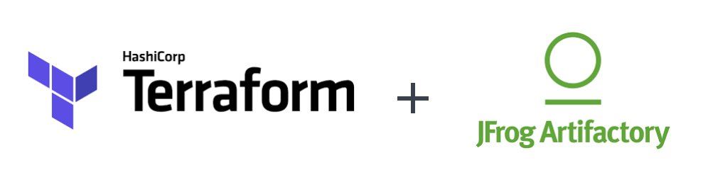
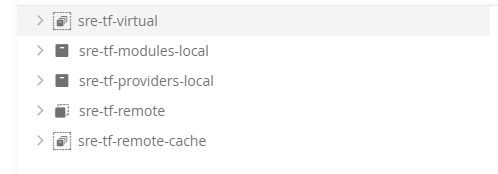
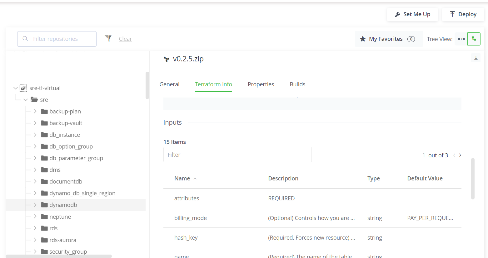

### Introduction

At LexisNexis we are still finding a rhythm when it comes to standardizing cloud application deployments. We have a mix of Cloudformation, ARM templates, custom python scripts, and terraform. It all works, but we are looking for ways to standardize and improve. I was watching a demo during Hashicorp's HashiTalks event that sparked my interest in a private terraform registry. We have used git repositories and the local filesystem in monorepos for module sharing, but we hadn't explored ways to make it more like a shopping experience when leveraging a pre-built module in our infrastructure code. Moreover, I was hoping to shine a light on some of terraform's best features. I was introduced to the technology when I was getting my Azure administrator certification (AZ-104), a friend recommended I look into terraform rather than spending a lot of time with ARM templates. I was instantly hooked and spent the next few months soaking up everything I could. It helped me learn the cloud platforms on a deeper level and allowed me to explore the services I was using on a deeper level.

When I started using terraform in a production setting, it started to become more obvious where standard modules can come into play. Especially in an organization that has strict security requirements or difficult configurations that take a while to develop. It would sure be nice to maintain a working copy of what an Azure App Service deployment requires and just drop it into my configuration. Another scenario is allowing teams to quickly spin up an ECS deployment with minimal configuration that's well-documented and easy to understand by running it through a standard pipeline.

Sometimes it's difficult to get this message to company leaders who can influence others to make this a common practice. My response was to illustrate the value of a private module repository using a product that we already use in-house. That product is JFrog Artifactory.


### Why use modules?

The answer to the question of "Why use modules?" is just another question. "Why not?" Terraform modules are designed to package up common elements that can be distributed and deployed without having to know or modify the underlying resources. When it comes to infrastructure-as-code (IaC), I've seen and been guilty of a considerable amount of copying and pasting code. Although this isn't necessarily frowned upon when talking about IaC, it still feels dirty. I've seen entire cloudformation templates dragged out of existing projects and dropped into new ones as a starting point for new projects, and it never goes as smoothly as anyone expects. Modules help us escape copy/paste hell, and get us into a legitimate software lifecycle model including building, testing and releasing code for consumers to implement. We can also increase standardization of the shape of infrastructure resources. We can default properties in the resources to the preferred values, and expose the more customizable properties as parameters. Also, we can build monitoring or networking components that comply with our security and quality requirements. By reducing the amount of code that consumers need to write to deploy the infrastructure, we reduce the complexity and therefore the time it takes to stand up new services. A strong library of modules also encourages IaC to be more DRY. Modules can use other modules. Some modules would be more specific to a use case while others can be more granular combinations of resources. Lastly, modules in a registry support semantic versioning. Consumers would be protected from changes to their infrastructure due to changes in the module unless they explicitly upgrade the module version. This allows the module maintainers to continue to improve and develop modules without compromising the integrity of the consumers.

### Options for terraform modules

Terraform offers a few options for module sources. The first is the [official terraform registry](https://registry.terraform.io). This is a public repository for shared modules available to the community, and probably the easiest option for hosting modules. However, when everything you develop is proprietary, putting it out on the internet for everyone to see doesn't always work within company policy. If you're working on a small team, or in a monorepo, local module sources on the filesystem work just fine. But, you can't quite reap the benefits of versioning your modules. You can get around that by using git submodules. Terraform can use git as the source and pull a ref to a tag or a branch. I've had some success with this, but it leaves something to be desired in terms of being easy to work with. Also, authenticating within pipelines can be a challenge. If you have the budget, Hashicorp Cloud Platform is an end-to-end solution for hosting and distributing private modules, building terraform pipelines, auditing terraform plan output and storing remote state. The last option is a private module registry. Any implementation of the terraform registry API specification can interact with the terraform CLI and be used as a module source. Open-source options like citizen provide a solution for someone looking to host their own. But some software as a service (SaaS) providers offers this support for their customers out of the box, like Artifactory!

### Artifactory as a terraform module registry

JFrog Artifactory is an enterprise solution for hosting and distributing terraform modules. Lucky for me, LexisNexis already uses it for storing build artifacts; and hosting private npm, PyPi, and Nuget registries. When you set up a repository in artifactory with a package type of Terraform, you can create local repositories for modules, local repositories for providers, remote repositories to proxy the official registry, and virtual registries to combine everything under a single endpoint. I focused on the local repository for modules and the virtual repository.



### Developing a module

Time to dig into some code! I'm going to focus on a simple DynamoDB module. The idea is to deploy a database with built-in monitoring and a standard name. The code below demonstrates a rough implementation without getting too far into the weeds. I leveraged a lot of default values on the variables that leave room for customization but keeps the more basic implementation lightweight.

```hcl
# sre/terraform-modules/aws/dynamodb/main.tf

locals {
  name = "${lookup(var.tags, "AssetID")}-${var.name}"
}

resource "aws_dynamodb_table" "this_dynamodb_table" {
  name                      = local.name
  billing_mode              = var.billing_mode
  hash_key                  = var.hash_key
  range_key                 = var.range_key
  read_capacity             = var.read_capacity
  write_capacity            = var.write_capacity
  tags                      = var.tags
  stream_enabled            = var.stream_enabled
  # If this fails, then create in locals
  ttl {
    enabled        = var.ttl_enabled
    attribute_name = var.ttl_attribute_name
  }
  server_side_encryption {
    enabled = var.server_side_encryption
  }
  point_in_time_recovery {
    enabled = var.point_in_time_recovery
  }
  timeouts {
    create = lookup(var.timeouts, "create")
    update = lookup(var.timeouts, "update")
    delete = lookup(var.timeouts, "delete")
  }
  dynamic "replica" {
    for_each = var.replica_regions
    content {
      region_name = replica.key
    }
  }
  dynamic "attribute" {
    for_each = var.attributes
    content {
      name = attribute.value.name
      type = attribute.value.type
    }
  }
}
```
```hcl
# sre/terraform-modules/dynamodb/cloudwatch.tf
data "aws_sns_topic" "AlarmTopic" {
  name = "AlarmPredicateTopic"
}
# CW Alarms for PROVISIONED DynamoDB Tables ONLY
resource "aws_cloudwatch_metric_alarm" "ConsumedReadCapacityUnits" {
  count               = var.billing_mode == "PROVISIONED" ? 1 : 0
  alarm_name          = "${local.name}-ConsumedReadCapacityUnits"
  evaluation_periods  = 1
  metric_name         = "ConsumedReadCapacityUnits"
  dimensions          = {
    TableName = local.name
  }
  statistic           = "Sum"
  threshold           = var.read_capacity
  alarm_actions       = [data.aws_sns_topic.AlarmTopic.arn]
  alarm_description   = "The number of read capacity units consumed over the specified time period"
  namespace           = "AWS/DynamoDB"
  period              = 60
  comparison_operator = "GreaterThanOrEqualToThreshold"
  tags                = var.tags
}
resource "aws_cloudwatch_metric_alarm" "ConsumedWriteCapacityUnits" {
  count               = var.billing_mode == "PROVISIONED" ? 1 : 0
  alarm_name          = "${local.name}-ConsumedWriteCapacityUnits"
  evaluation_periods  = 1
  metric_name         = "ConsumedWriteCapacityUnits"
  dimensions          = {
    TableName = local.name
  }
  statistic           = "Sum"
  threshold           = var.write_capacity
  alarm_actions       = [data.aws_sns_topic.AlarmTopic.arn]
  alarm_description   = "The number of read capacity units consumed over the specified time period"
  namespace           = "AWS/DynamoDB"
  period              = 60
  comparison_operator = "GreaterThanOrEqualToThreshold"
  tags                = var.tags
}
# CW Alarms for ANY DynamoDB Table
resource "aws_cloudwatch_metric_alarm" "ReadThrottleEvents" {
  alarm_name          = "${local.name}-ReadThrottleEvents"
  evaluation_periods  = 1
  metric_name         = "ReadThrottleEvents"
  dimensions          = {
    TableName = local.name
  }
  statistic           = "Sum"
  threshold           = 0
  alarm_actions       = [data.aws_sns_topic.AlarmTopic.arn]
  alarm_description   = "Requests to DynamoDB that exceed the provisioned read capacity units for a table."
  namespace           = "AWS/DynamoDB"
  period              = 60
  comparison_operator = "GreaterThanThreshold"
  tags                = var.tags
}
resource "aws_cloudwatch_metric_alarm" "WriteThrottleEvents" {
  alarm_name          = "${local.name}-WriteThrottleEvents"
  evaluation_periods  = 1
  metric_name         = "WriteThrottleEvents"
  dimensions          = {
    TableName = local.name
  }
  statistic           = "Sum"
  threshold           = 0
  alarm_actions       = [data.aws_sns_topic.AlarmTopic.arn]
  alarm_description   = "Requests to DynamoDB that exceed the provisioned read capacity units for a table."
  namespace           = "AWS/DynamoDB"
  period              = 60
  comparison_operator = "GreaterThanThreshold"
  tags                = var.tags
}
resource "aws_cloudwatch_metric_alarm" "SuccessfulRequestLatency" {
  alarm_name          = "${local.name}-SuccessfulRequestLatency"
  evaluation_periods  = 1
  metric_name         = "SuccessfulRequestLatency"
  dimensions          = {
    TableName = local.name
  }
  statistic           = "Average"
  threshold           = 100
  alarm_actions       = [data.aws_sns_topic.AlarmTopic.arn]
  alarm_description   = "The successful requests to DynamoDB or Amazon DynamoDB Streams during the specified time period."
  namespace           = "AWS/DynamoDB"
  period              = 60
  comparison_operator = "GreaterThanThreshold"
  tags                = var.tags
}
```

### Package and deploy

Now that we have the repositories set up and the module developed, let's set up a pipeline to deploy the module to artifactory. The key here is to use the JFrog CLI. Initially, when you set up the directory you're storing your modules in you need to run a `jf tf config` command to set up the `.jfrog` directory and the subsequent `terraform.yaml` manifest that tells the CLI which server and which repository to publish the modules. After that, you're only a few commands away from publishing your first version. I set up a really simple Jenkins pipeline that takes a single "version" parameter and runs the CLI commands to publish the modules in a build. It looks something like this.

```groovy
// PublishTerraformModules.groovy
    stage('Install JFrog CLI') {
      steps {
        nodejs('Node16') {
          sh 'npm install jfrog-cli-v2-jf'
          // this is a funky workaround... technically
          // you should just be able to pass the --user,
          // --password, and --url options to the
          // jf tf publish command
          sh "npx jf config remove ${ARTIFACTORY_SERVER_ID} --quiet"
          sh "npx jf config add ${ARTIFACTORY_SERVER_ID} \
                --artifactory-url ${ARTIFACTORY_URL} \
                --user ${ARTIFACTORY_USR} \
                --password ${ARTIFACTORY_PSW}"
        }
      }
    }
    stage('Publish AWS to artifactory') {
      // One stage per provider
      steps {
        dir(AWS_MODULES_DIR) {
          nodejs('Node16') {
            sh "npx jf terraform publish \
                --namespace ${ARTIFACTORY_NAMESPACE} \
                --provider aws --tag ${params.version}"
          }
        }
      }
    }
```

The CLI publishes the modules and you can view them in the UI of Artifactory repository (either the local version or the virtual version).


### Consuming the modules

So how do we consume these modules. As a developer, building out infrastructure requires less guesswork. Pick a module, fill in the required parameters with knowns based on the service you're developing and start reaping the benefits of the shared module. A remote backend does need to be provisioned ahead of time, but once that is configured you can start your terraform configuration.
```hcl
# demo/infrastructure/main.tf
module "dynamodb" {
  source = "myartifactoryserver.jfrog.io/sre-tf-virtual__sre/dynamodb/aws"
  version = "v0.2.5"

  name = "awesome-db"
  billing_mode = "PAY_PER_REQUEST"
  hash_key = "ID"
  attributes = [{
    name = "ID"
    type = "S"
  }]
  tags = var.tags
}
```
Terraform needs to know how to access the module. Luckily, artifactory spells this out for all the busy people out there with the "Set Me Up" button. When you select terraform as your package type, it provides you an API token and the terraform commands to get started. Armed with your API token you just need to use the interactive `terraform login` command to set up authentication to the artifactory module source.

```bash
$ terraform login myartifactoryserver.jfrog.io
```
Alternatively, you could set an environment variable. This is helpful in a pipeline scenario. Either way, you're configuring terraform at the CLI level.

```bash
$ export TF_TOKEN_myartifactoryserver_jfrog_io=$myartifactorytoken
```

After that, the true beauty of terraform shines through. Provisioning the infrastructure requires the same few terraform CLI commands.

```bash
$ terraform init
$ terraform plan
$ terraform apply
```

### What about in a pipeline?

The same principles apply in a pipeline as they do locally. In this case, the SRE team has a generic parameterized jenkins job that implements the terraform init, plan and apply stages with some additional steps like [checkov](https://checkov.io) IaC scanning and offers some customizable steps to run scripts specific to the project being built. For this example, my demo consumer project sets the `TF_TOKEN` environment variable to a jenkins credential storing my API token retrieved from artifactory, and otherwise seamlessly pulls the module down and deploys to the chosen account.

### Testing the modules

From a software perspective, I'm a big promoter of test-driven development and pragmatic testing of software. This was my first real experience testing terraform code. I had heard of [Terratest](https://terratest.gruntwork.io) before but until now didn't have a really clear reason for using it. When thinking of building a library of modules for the company to reuse across our infrastructure, I would of course want to ensure quality was built into our modules. Terratest provides a framework for spinning up _real_ infrastructure in a _real_ cloud account so you can write tests that make assertions on the outputs of the module or the actual resources being deployed. I'm still new to Go, so I opted for a simple example. Spin up my dynamo table and ensure the outputs are what I expect.

```go
// dynamodb_test.go
func Test_DynamoDbTable_When_BillingMode_is_PayPerRequest(t *testing.T) {
	// Arrange
	fake := faker.New()
	name := fake.RandomStringWithLength(10)
	assetId := fmt.Sprint(fake.RandomNumber(4))
	attributes := make([]map[string]string, 2)
	hashKey := fake.RandomStringWithLength(10)
	rangeKey := fake.RandomStringWithLength(10)
	attributes[0] = map[string]string{
		"name": hashKey,
		"type": "S",
	}
	attributes[1] = map[string]string{
		"name": rangeKey,
		"type": "S",
	}

	terraformOptions := terraform.WithDefaultRetryableErrors(t, &terraform.Options{
		TerraformDir: "../../aws/dynamodb",
		Vars: map[string]interface{}{
			"name":         name,
			"billing_mode": "PAY_PER_REQUEST",
			"hash_key":     hashKey,
			"range_key":    rangeKey,
			"timeouts": map[string]string{
				"create": "10m",
				"update": "60m",
				"delete": "10m",
			},
			"replica_regions": map[string]string{},
			"attributes":      attributes,
			"tags": map[string]string{
				"AssetID":          assetId,
				"CreatedBy":       "terratest",
			},
		},
	})

	// Act
	defer terraform.Destroy(t, terraformOptions)
	terraform.InitAndApply(t, terraformOptions)

	output := terraform.OutputAll(t, terraformOptions)
	// Assert
	assert.NotNil(t, output[OUTPUT_TABLE_ARN])
	assert.Contains(t, output[OUTPUT_TABLE_ID], assetId)
	assert.Contains(t, output[OUTPUT_TABLE_ID], name)
	assert.NotNil(t, output[OUTPUT_CW_LATENCY])
	assert.NotNil(t, output[OUTPUT_CW_WRITETHROTTLE])
	assert.NotNil(t, output[OUTPUT_CW_READTHROTTLE])
}

```

Once you have you're test set up, you can run the tests recursively using `go test -v ../. --count 1`. I included the `count` option to avoid Golang's automatic caching of the tests. Since we aren't modifying as much go code as we are modifying terraform code, we don't want to cache the test very often. It's pretty satisfying watching the verbose output spin up the resources, validate, and then destroy them.
My use case was for AWS, but this framework holds true for Azure, Kubernetes, Docker, Packer, etc. Anything executing terraform can be tested to enhance your modules with automated quality checks. I'm really excited to dig into this further and make the most of it.

The last step was to add Terratest to the Jenkins job that publishes the modules to artifactory. That way any new code would need to pass tests before being deployed. A run-of-the-mill CI/CD pipeline.

### Conclusion

This was a really exciting project to prove out. It will be interesting to see how we can evangelize the practice into a mechanism internally to help our engineers deploy services faster and with more confidence. Terraform continues to amaze me with what it's capable of. Adding a semi-official module registry for our teams to pull from is the next level of improving our processes internally. And the fact that we don't have to propose buying new software licenses or learn new tools to do so makes the success of this project that much sweeter.


