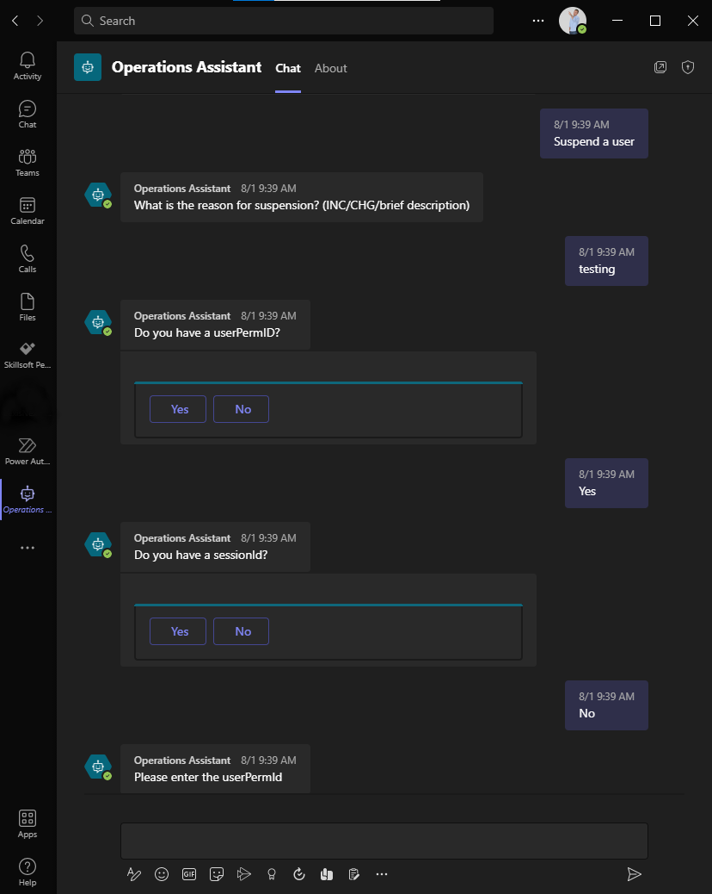
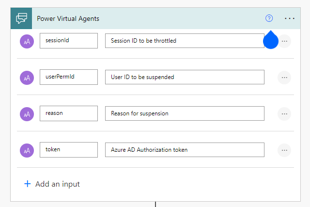

## The problem

I was recently tasked with creating an automation that would help our Operations team suspend a user who was determined to be abusing our system. Meaning, our infrastructure is taking a hit because of an automated script, a bot, or an otherwise authorized user who was putting unusual load on a critical asset. In order to maintain response times, and preserve the reliability of the system, this user needs to be suspended as soon as possible.
In talking with Ops, we identified the process for suspending a user was between 8 and 10 steps and decisions, utilizing 3 or more tools including logging into a production database. To reduce the response time for an incident, we decided this process could be triggered manually and the steps executed programmatically.

## The idea

During an incident, Ops uses Microsoft Teams as a communication platform. Most of an incident is managed through a Teams room. An abusive user can be identified through a Splunk dashboard courtesy of our Operational Analytics team. It would be amazing if they wouldn't need to leave the channel to perform this task. Identify the user, and execute the automation directly in the teams channel.
MS Teams would also allow us to use our Active Directory for authentication and authorization of the task.

Teams bots come in several different varieties. Webhook bots allow for a sort of "one-sided" conversation, and conversational bots can drive outcomes from natural language. Conversational bots offer a better user experience, and can provide more details if and when failures occur. They also provide additional features and less complex security than working with webhooks. You can build a conversational bot in MS Teams two ways.
You can build a bot from scratch using Azure Bot framework, or you can use Microsoft's Power Virtual Agents (PVA). I'm generally not a huge fan of low code/no code platforms. But given my use case, and the time constraints, I decided to give it a try.

Generally, our infrastructure is all hosted in AWS, and my teams proficiency using Python Lambda functions was a major decision making factor in the backend logic for our application. The bot would need to call an authorized endpoint, and provide a payload that would initiate suspending a user. AWS API Gateway provides a great interface for securing Lambda functions and acting as a REST API. We could spin up a lambda function and an api gateway relatively quickly and be ready to trigger the automation from anywhere.

## The execution

The bot would be calling and endpoint with two downstream APIs to complete the intended action. These APIs required different forms of authentication, one being Azure Active Directory, the other being a custom Service-to-Service user. We wanted to restrict the endpoint to a group of users in Active Directory, and validate the token was coming from the correct application and audience. The end user would `@mention` the bot aka `@Operations Assistant` and use a trigger phrase such as "suspend" to kick off the flow, which would gather information and build the api request.

### Developing the "API"

The API would be simple, but we wanted to allow room for extension. We'll have a single endpoint that would `POST` to "Create" an Abusive User entity. I've learned it's better to follow REST principals from the start, rather than try and retrofit them later. You never know when you may want to persist data. Theoretically, this would leave room for a `DELETE` or a `GET` to either re-activate a suspended user or list users currently suspended by the app.

Coming from a .NET background, I had to learn python on the go. But the syntax being fairly friendly to pick up, and plenty of good cheatsheets to get me started had us up and running with a Lambda. It didn't do anything yet, but it covered the basics. We started by wrapping the first service, which is authenticated with a Service-to-Service Id. In other words, a username and password for the service to identify our app.

In learning about Lambda and reading through others work, I learned that it's easy to create a lambda that's basically an entire application in a gigantic single file. This isn't something I was interested in. I didn't want to clutter the lambda with the complexity of setting up HTTP calls to two api's. Come to think of it, those could be two separate packages that live independent of the lambda.

Using [python setup tools](https://setuptools.pypa.io/), I created two new packages that would service as wrappers for the downstream API's. A benefit of this strategy was that the api wrappers could be independently tested and ultimately distributed for other uses. The lambda function would simply include these packages as dependencies. I could (and maybe should) write an entire post on python api client development strategies. But for the purposes of this post, I'll leave the details out.

With my newly created packages wrapping up my downstream API's, I was ready to integrate the functionality into the lambda. [Lambda powertools](https://awslabs.github.io/aws-lambda-powertools-python/latest/) offers a really nice way of converting a lambda function into more of a API Controller. It also brings a number of utilities and types that help ease the trial and error of working with lambda. The below snippet is an abbreviated version of what the lambda function looked like while demonstrating some of the functions Lambda powertools brings to the table.

```python
# lambda_users_api/handler.py
config = Config() # Custom class handling environment variables and constants
tracer = Tracer()
logger = Logger()
app = APIGatewayRestResolver()

@app.post("/users")
@tracer.capture_method
def post():
    try:
        app.current_event.headers["Authorization"]
    except KeyError:
        return ErrorResponse("Authorization header not found").to_json()

    access_token = authorization.replace("Bearer", "").strip()
    data = app.current_event.json_body
    abusive_user = AbusiveUser(
        user_id=data["user_id"], status=data["status"], reason=data["reason"])

    # Get secrets from AWS Secrets Manager
    service2service_password = parameters.get_secret(config.service_id_param_name)
    client_secret = parameters.get_secret(config.client_secret_param_name)

    # Authorize the first API's HTTP Client
    user_api_client = user_service.get_client(
        username=config.service2service_id, password=service2service_password, logger=logger)

    # Acquire token on behalf of the user
    throttler_access_token = throttler_service.get_access_token(access_token, logger)
    throttler_api_client = throttler_service.get_client(throttler_access_token)

    # Pass authenticated HTTP clients, and perform the underlying logic of suspending the user
    create_result = abusive_user_service.create(
        user=abusive_user, user_client=user_api_client, throttler_client=throttler_api_client)

    if create_result.is_err():
        return ErrorResponse(create_result.err()).to_json()
    user = create_result.ok()
    return OkResponse(user.to_dict()).to_json()

@logger.inject_lambda_context(correlation_id_path=correlation_paths.API_GATEWAY_REST)
@tracer.capture_lambda_handler
def main_handler(event: dict, context: LambdaContext) -> dict:
    return app.resolve(event, context)
```

You get the picture. Concise, easy to read, and extensible.

### Building the Bot

The next step was creating a trigger mechanism, which had been identified as a Teams conversational bot. Create a bot via the Power Virtual agents web app and choose a name. I picked "Operations Assistant." Your first bot may take a while to create, but you'll land on the homepage where you can start creating your own _Topics_ and _Entities_. Topics are a dialog tree triggered by a phrase or set of phrases. Entities are predefined data sets or data type (i.e U.S States).

Creating a topic starts by picking trigger phrases that the user would type into Teams and the bot would pick up and reply with the first step of the dialog. I needed to collect two or three fields from the user in order to run my api call. This equated to series of questions and answers that would determine the path of the dialog.



If you need the bot to do something other than ask questions and take responses, look to Microsoft Power Automate Flows. From the bot you can call an action, which can be a custom flow. Flows are another low code/no code platform for building automated business processes. If you haven't created one, and need to add one for your bot, there is an option to create a new flow right from the menu. When creating a flow from PVA, it starts with an input from Power Virtual Agents. Here is where you define the inputs the bot will need to provide.



In this case, I needed to make a simple API call and parse the response to return to the user. This is a simple workflow, but not an easy task to complete through the UI. The HTTP request action meets the requirement for running an API call, but doesn't do you any favors. There are ways of creating your own custom connectors to avoid the pain and create a more immersive experience for the non-coder, but I had little luck with them. Especially considering my API required OAuth authentication. Learn more about custom connectors [here](https://docs.microsoft.com/en-us/connectors/custom-connectors/).

Once the HTTP Request and the JSON Response are parsed, the flow ends with an action to "Return values to Power Virtual Agents." If the flow is successful, the bot will receive the values and store them as variables to inform future decisions in the dialog. One caveat, Flows do not handle optional inputs from power virtual agents even though the UI would claim otherwise. I had to create several identical flows that took different inputs to handle the possibility of null values, and then build that into the decision logic of my PVA. For the sake of future no-coders, I hope that issue will be resolved soon.

Now that my bot can call the API and respond accordingly based on the result, I'm ready to tackle the authentication.

### Authorization
#### Azure App Registrations

Authentication and Authorization often cause a lot of frustration. One of the reasons I liked the idea of Power Virtual Agents was the SSO capability that came out of the box. Within PVA, you can secure your bot several ways. Since I needed to pass an access token to my API for downstream api authorization, I went the route of "Manual" auth. This requires an Azure App Registration to be created for your bot. This is the only option that allows you to use the AuthToken as a variable in the Topic.

When creating the app registration, I locked the registration to a single tenant and added a redirect uri for `https://token.botframework.com/.auth/web/redirect` as directed by the documentation. Then you'll need to generate a client secret to configure the manual authentication in PVA. Since one of my downstream APIs requires Azure AD authentication, my app will be acquiring a token for that API on behalf of the user. The  This required the app registration to "Expose an API" by defining a scope. I used `api://<client_id>/access_as_user` as the scope for the bot in the AAD Security settings. In addition, the app registration requires an API Permission added for the designated scope of the downstream API. For example, if the scope of the downstream API I need to access is `api://<client_id>/Items.Write`, `Items.Write` would need to be added to the API permissions of my app registration to grant programmatic access.


By default, the bot will authenticate the user to Microsoft's Graph API using the `openid` and `profile` scopes. If the `access_as_user` scope is not set on the bot, the AuthToken passed from the bot will have and audience value of MS Graph API, rather than the App Registration defined for this app. This causes the downstream API to throw the error `AADSTS50013: Key was found, but use of the key to verify the signature failed` when getting the access token on-behalf-of the user.

> [More on configuring AAD with PVA.](https://docs.microsoft.com/en-us/power-virtual-agents/configuration-end-user-authentication#use-azure-active-directory-as-your-identity-provider)

Now when users interacts with the bot, it will first prompt them to sign in. Additionally, I now have access to the `AuthToken` to be passed as a parameter to the Flows running HTTP Requests against the API.

#### API Gateway Lambda Authorizer

API Gateway provides the concept of Lambda Authorizers, which provide developers a means of writing custom validation logic for their endpoints. Before any endpoint is hit, API gateway would first run the authorizer. I needed a simple validation mechanism that could decode the JWT passed from the bot to the API in the `Authorization` header. Pulling the bearer token from the header and using a library like [PyJWT](https://pyjwt.readthedocs.io/en/stable) makes this a painless way to validate your token.

The better way to do this would be to have an App Registration for the bot, and an App Registration for the API. Once again, promoting the OBO (On behalf of) flow and separating the security aspects of the applications with scopes. But this was after all, a proof of concept.

### Testing

With the bot and the api secured, the only thing left is to publish and test the bot from MS Teams. In the left side menu there is a "Publish" option, which takes you to the Publish page. Clicking the "Publish" button will start the process of making the bot available in MS Teams and through the demo website. After a few minutes, the bot becomes available and has an option to open in Teams.
I had to make quite a few *adjustments* to make everything work correctly. There is a web client in the PVA editor that allows live testing your changes, but to test it out in MS Teams, it needs to be re-published each time. To name a few:
* Lining up the JSON response in the flow and the api
* Reworking the topic logical flow for dialog
* Assigning the correct headers in the HTTP action of the Flow
* Inverting the response from the Flow to the bot.
* ...and more

But it worked! I had a Teams Bot, secured with Azure AD making api calls to downstream API's. Success!

## The pivot

Turns out, PVA is a premium product in the suite of Microsoft Power Platform. When the company ultimately doesn't feel like shelling out for a license, sometimes you have to go back to basics. For simplicity, I opted to invoke a lambda from an SSM Document until a viable frontend client could be built. The design of the lambda made it easy to refactor from an API Gateway resolved endpoint into a simple lambda. I lost the Azure AD authentication of the end user, but still maintained AD authentication with the lambda acting as a daemon app. Rather than the OBO flow (`acquire_token_on_behalf_of`), I used the client flow `acquire_token_for_client` with a Confidential Client Application.

## Conclusion

Power Virtual Agents and Power Automate are useful tools, that cost money. From an agility perspective, the speed to market of spinning up a Teams bot through PVA is enticing. Especially with the security features it comes with out of the box. However, as a technical person, these tools are extremely frustrating to use. I found myself wanting to spin up my own bot at least 100 times so I could control the behavior and run things my way. I may have come to the same result, but I'm glad I saw it through.