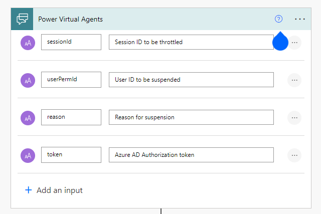
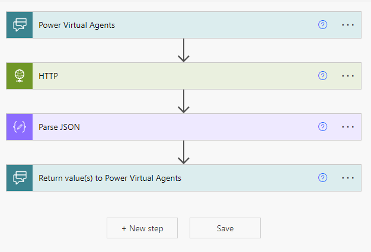

## The problem

Recently, I was tasked with developing an automated solution to help our Operations team stop someone who was abusing our system. Essentially, our infrastructure is being damaged by a script, bot, or otherwise authorized person putting an unusual load on a critical asset. In order to maintain response times and maintain system reliability, this user needs to be suspended immediately. Based on our conversation with Ops, we identified there were between eight and ten steps and decisions needed to suspend a user. These steps included logging into a production database and using various tools. In order to reduce incident response time, we decided to trigger the process manually and run the steps programmatically.

## The idea

Ops uses Microsoft Teams during incidents for communication. Incidents are managed through a Teams room. By using the Splunk dashboard provided by our Operational Analytics team, we are able to identify abusive users by ID, session, and volume of activity. Ideally, they would not have to leave the channel to perform this task, they could execute the automation directly in the Microsoft Teams channel after identifying the user.
In addition, integrating with Microsoft Teams would allow us to use our Active Directory for authentication and authorization.

Teams bots are available in several varieties. With webhook bots, you can have a one-sided conversation, while conversational bots can drive outcomes from natural language. A conversational bot can offer a better user experience and provide more information when a failure occurs. Additionally, they provide more features and less complex security implementations than webhooks. There are two ways to build a conversational bot in MS Teams.
You can either build a bot from scratch or use Microsoft's Power Virtual Agents (PVAs). Low-code/no-code platforms are generally not my thing. Due to time constraints and my use case, I decided to try it.

All of our infrastructure for our application is hosted on AWS, and the team's skills in using Python Lambda functions were a critical factor in our technology choices. The bot would need to call an authorized endpoint and provide a payload that would initiate suspending a user. AWS API Gateway provides a great interface for securing Lambda functions and acting as a REST API. We could spin up a lambda function and an API gateway relatively quickly and be ready to trigger the automation from anywhere.

## The execution

The bot would call an endpoint with two downstream APIs to complete the intended action. These APIs required different forms of authentication, one being Azure Active Directory, the other uses basic authentication with a designated service user. We wanted to restrict the endpoint to a group of users in Active Directory and validate the token was coming from the correct application and audience. The end user would `@mention` the bot A.K.A `@Operations Assistant` and use a trigger phrase like "suspend" to kick off the flow. The automated flow would then build and invoke an HTTP request and respond to the bot based on the result.

### Developing the "API"

The API would be simple, but we wanted to allow room for extension. We'll have a single endpoint that would `POST` to "Create" an Abusive User entity. I've learned it's better to follow REST principles from the start, rather than try and retrofit them later. You never know when you may want to persist data. Theoretically, this would leave room for a `DELETE` or a `GET` to either re-activate a suspended user or list users currently suspended by the app.

Coming from a .NET background, I had to learn python on the go. But the syntax being fairly friendly to pick up, and plenty of good cheat sheets to get me started had us up and running with a Lambda. It didn't do anything yet, but it covered the basics. We started by wrapping the first service, which is authenticated with a Service-to-Service Id. In other words, a username and password for the service to identify our app.

My preliminary research into AWS Lambda revealed a pattern of writing an entire application in a single (massive) python file. I wasn't interested in doing this at all. Rather than clutter the core Lambda with complex middleware,  I split the project into three parts: two independent packages that would wrap the third-party APIs and a lambda function comprised of small service modules.

I created my python packages using [python setup tools](https://setuptools.pypa.io/) and set them up as dependencies to the lambda function. Now, the packages could be independently tested and distributed for other uses. The lambda function is simply a consumer. I could (and maybe should) write an entire post on python API client development strategies. But for this post, I'll leave the details out.

Now that the libraries were ready, I integrated the functionality into the lambda and started to develop the API interface. [Lambda powertools](https://awslabs.github.io/aws-lambda-powertools-python/latest/) offers a nice way of converting a lambda function into more of an API Controller. It has utilities and types that help ease the trial and error of working with lambda and API Gateway. The below snippet is an abbreviated version of what the lambda function looked like while demonstrating some of the functions Lambda powertools brings to the table. The `Logger` provided a major upgrade to the default logging configuration I was providing to the app. It provides a structured JSON output that captures great information about the events being logged, which makes querying it in your log provider a breeze.

```python
# lambda_users_api/handler.py
config = Config() # Custom class handling environment variables and constants
tracer = Tracer()
logger = Logger()
app = APIGatewayRestResolver()

@app.post("/users")
@tracer.capture_method
def post():
    try:
        app.current_event.headers["Authorization"]
    except KeyError:
        return ErrorResponse("Authorization header not found").to_json()

    access_token = authorization.replace("Bearer", "").strip()
    data = app.current_event.json_body
    abusive_user = AbusiveUser(
        user_id=data["user_id"], status=data["status"], reason=data["reason"])

    # Get secrets from AWS Secrets Manager
    service2service_password = parameters.get_secret(config.service_id_param_name)
    client_secret = parameters.get_secret(config.client_secret_param_name)

    # Authorize the first API's HTTP Client
    user_api_client = user_service.get_client(
        username=config.service2service_id, password=service2service_password, logger=logger)

    # Acquire token on behalf of the user
    throttler_access_token = throttler_service.get_access_token(access_token, logger)
    throttler_api_client = throttler_service.get_client(throttler_access_token)

    # Pass authenticated HTTP clients, and perform the underlying logic of suspending the user
    create_result = abusive_user_service.create(
        user=abusive_user, user_client=user_api_client, throttler_client=throttler_api_client)

    if create_result.is_err():
        return ErrorResponse(create_result.err()).to_json()
    user = create_result.ok()
    return OkResponse(user.to_dict()).to_json()

@logger.inject_lambda_context(correlation_id_path=correlation_paths.API_GATEWAY_REST)
@tracer.capture_lambda_handler
def main_handler(event: dict, context: LambdaContext) -> dict:
    return app.resolve(event, context)
```

Concise, easy to read, and extensible.

### Building the Bot

The next step was creating a trigger mechanism, which had been identified as a Teams conversational bot. Create a bot via the Power Virtual agents web app and choose a name. I picked "Operations Assistant." Your first bot may take a while to create, but you'll land on the homepage where you can start creating your own _Topics_ and _Entities_. Topics are dialog trees triggered by a phrase or set of phrases. Entities are predefined data sets or data types (i.e U.S States).

To create a topic, you start by picking trigger phrases that the user would type into Teams and the bot would pick up and reply with the first step of the dialog. I only needed to collect two or three fields from the user to invoke the API. I created a series of questions and answers in the visual editor that determined the path of the dialog.


If you need the bot to do something other than asking questions and taking responses, you need to incorporate Microsoft Power Automate Flows. From the bot, you can call an "action", which can be a custom "flow". Flows are another low code/no code tool for building automated business processes. If you haven't created one, and need to add one for your bot, there is an option to create a new flow from the menu in your actions. When creating a flow from PVA, it starts with input from Power Virtual Agents.



In this case, I needed to make an API call to the API Gateway, parse the response and prepare a response to the Virtual Agent. This is a simple workflow, but not an easy task to complete through the UI. The HTTP request action meets the requirement for running an API call but doesn't do you any favors. There were many rounds of battling with Power Automate before it behaved well enough to continue on.


You can create custom connectors from an OpenAPI spec to avoid this pain and create a more immersive experience for the no-coder, but I had little luck with them. The API required OAuth authentication, and the features often require a premium license or trial to use effectively. However, the concept shows promise. It would have been a lot more fun to create an automated flow without having to wrangle with the generic HTTP Request, and instead use a semi-native task that only required the inputs for the call.

> More about custom connectors [here](https://docs.microsoft.com/en-us/connectors/custom-connectors/).

Once the HTTP Request and the JSON Response are parsed, the flow ends with an action to "Return values to Power Virtual Agents." If the flow is successful, the bot receives the values and stores them as variables in the topic. One caveat, Flows do not handle optional inputs from power virtual agents even though the UI would claim otherwise. I had to create several identical flows that took different inputs to handle the possibility of null values and build that into the topic. For the sake of future no-coders, I hope that issue will be resolved soon.



Now that my bot can call the API and respond accordingly based on the result, I'm ready to tackle the authentication.

### Authorization
#### Azure App Registrations

Authentication and Authorization often cause a lot of frustration. One of the reasons I liked the idea of Power Virtual Agents was the SSO capability that came out of the box. Within PVA, you can secure your bot in several ways. Since I needed to pass an access token to my API for downstream API authorization, I went the route of "Manual" auth. This requires an Azure App Registration to be created for your bot. This is the only option that allows you to use `AuthToken` as a variable in the Topic.

When creating the app registration, I locked the registration to a single tenant and added a redirect URI for `https://token.botframework.com/.auth/web/redirect` as directed by the documentation. Then you'll need to generate a client secret to configure the manual authentication in PVA. Since one of my downstream APIs requires Azure AD authentication, my app will be acquiring a token for that API on behalf of the user. This required the app registration to "Expose an API" by defining a scope. I used `api://<client_id>/access_as_user` as the scope for the bot in the AAD Security settings. In addition, the app registration requires an API Permission added for the designated scope of the downstream API. For example, if the scope of the downstream API I need to access is `api://<client_id>/Items.Write`, `Items.Write` would need to be added to the API permissions of my app registration to grant programmatic access.


By default, the bot will authenticate the user to Microsoft's Graph API using the `openid` and `profile` scopes. If the `access_as_user` scope is not set on the bot, the AuthToken passed from the bot will have an audience value of MS Graph API, rather than the App Registration defined for this app. This causes the downstream API to throw the error `AADSTS50013: Key was found, but use of the key to verify the signature failed` when getting the access token on behalf of the user.

Now when users interact with the bot, it will first prompt them to sign in. Additionally, I now have access to the `AuthToken` to be passed as a parameter to the Flows running HTTP Requests against the API.

```python
from msal import ConfidentialClientApplication
from authlib import Oauth2Auth

def get_access_token(bearer_token: str) -> Result[ThrottlerClient, dict]:
    authority = f"https://login.microsoftonline.com/{config.tenant_id}"
    client_secret = os.ENVIRON["CLIENT_SECRET"]
    app = ConfidentialClientApplication(
        client_id=config.client_id,
        client_credential=client_secret,
        authority=authority)

    token_response = app.acquire_token_on_behalf_of(
        user_assertion=access_token, # The incoming token already received by this app
        scopes=["api://<CLIENT_ID>/Items.Write"]) # API permissions scopes allowed on client app for downstream API

    if "error" in token_response:
        error = token_response["error"]
        err_description = token_response["error_description"]
        return Err(f"{error}: {err_description}")

    return Ok(token_response["access_token"])

def get_client(bearer_token: str) -> Result[ThrottlerClient, ErrorResponse]:
    token_result = get_access_token(bearer_token)
    if token_result.is_err():
        message=token_result.err()
        logger.error(message)
        result = ErrorResponse([message]).to_json()
        return Err(result)

    token={"token_type": "bearer", "access_token": throttler_access_token_result.ok()}
    throttler_auth = OAuth2Auth(token)
    client = ThrottlerClient(auth=throttler_auth)
    return Ok(client)
```

> [More on configuring AAD with PVA.](https://docs.microsoft.com/en-us/power-virtual-agents/configuration-end-user-authentication#use-azure-active-directory-as-your-identity-provider)


#### API Gateway Lambda Authorizer

API Gateway provides the concept of Lambda Authorizers, which allows developers to write custom validation logic for their endpoints. Before any endpoint is hit, the API gateway would first run the authorizer. I needed a simple validation mechanism that could decode the JWT passed from the bot to the API in the `Authorization` header. Pulling the bearer token from the header and using a library like [PyJWT](https://pyjwt.readthedocs.io/en/stable) makes this a painless way to validate your token.

The better way to do this would be to have an App Registration for the bot, and an App Registration for the API. Once again, promoting the OBO (On behalf of) flow and separating the security aspects of the applications with scopes. But this was, after all, a proof of concept.

### Testing

With the bot and the API secured, the only thing left is to publish and test the bot from MS Teams. In the sidebar menu, there is a "Publish" option, which takes you to the Publish page. Clicking the "Publish" button starts the process of making the bot available in MS Teams and through the demo website. It usually only takes a few minutes.
I had to make quite a few *adjustments* between the API, the topic, and the flows to make everything work correctly. There is a web client in the PVA editor that allows live testing of your changes, but to test it out in MS Teams, it needs to be re-published each time. To name a few:
* Lining up the JSON response in the flow and the API
* Reworking the topic's logical flow for dialog
* Assigning the correct headers in the HTTP action of the Flow
* Inverting the response from the Flow to the bot.
* ...and more

But it worked! The bot was deployed to the organization and secured with Azure AD making API calls to downstream APIs. Success!


## The pivot

Turns out, PVA is a premium product in the suite of Microsoft Power Platform. The company wasn't interested in adding yet another suite of software to our operating budget, and I don't blame them. Sometimes you have to go back to basics. For simplicity, I opted to invoke the lambda from an AWS Systems Manager automations until a viable frontend client could be built. The design of the lambda made it easy to refactor from an API Gateway resolved endpoint into a simple lambda. I lost the Azure AD authentication of the end user, but still maintained AD authentication with the lambda acting as a daemon app. Rather than the OBO flow (`acquire_token_on_behalf_of`), I used the client flow `acquire_token_for_client` with a Confidential Client Application.

## Conclusion

Power Virtual Agents and Power Automate are useful tools, but they aren't free! From an agility perspective, the speed to market of spinning up a Teams bot through PVA is enticing. Especially with the security features, it comes out of the box. However, as a technical person, these tools are extremely frustrating to use. I found myself wanting to spin up a custom bot at least 100 times so I could control the behavior and run things my way. I may have come to the same result, but I'm glad I saw it through.
